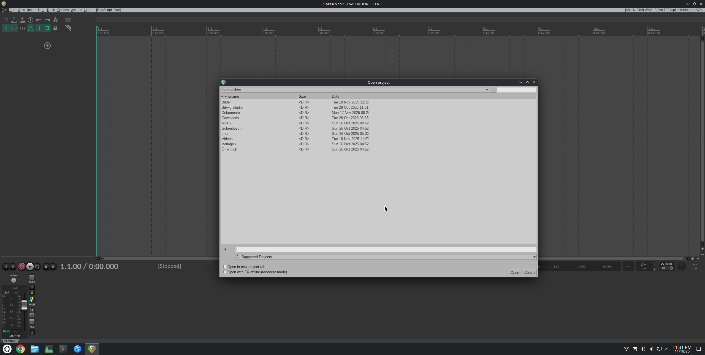
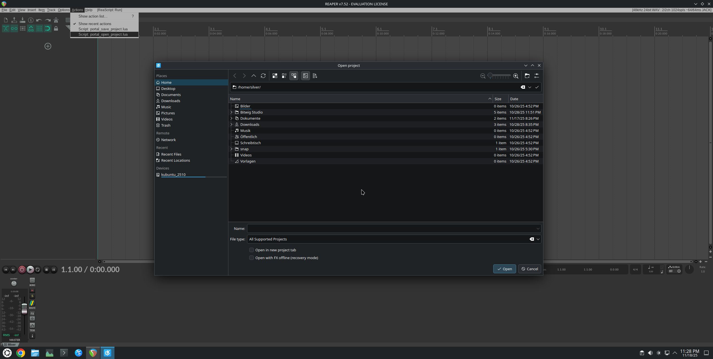
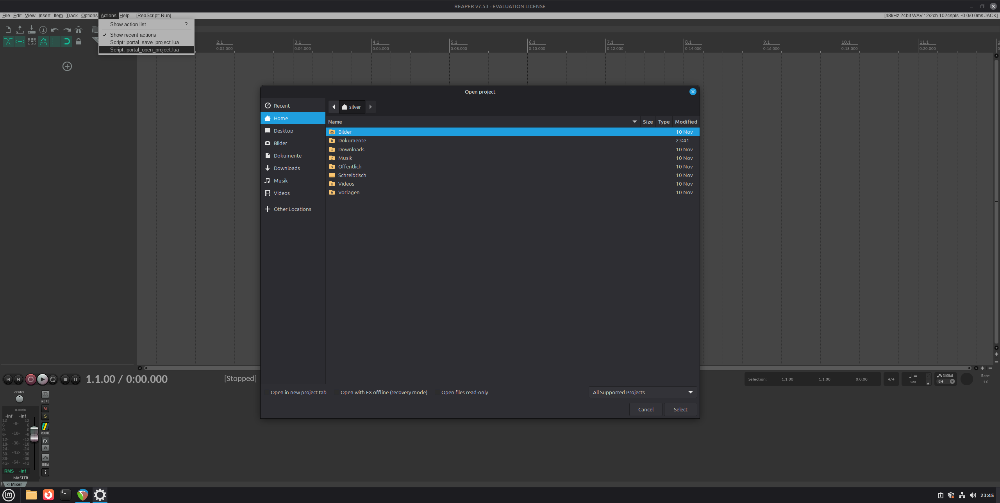
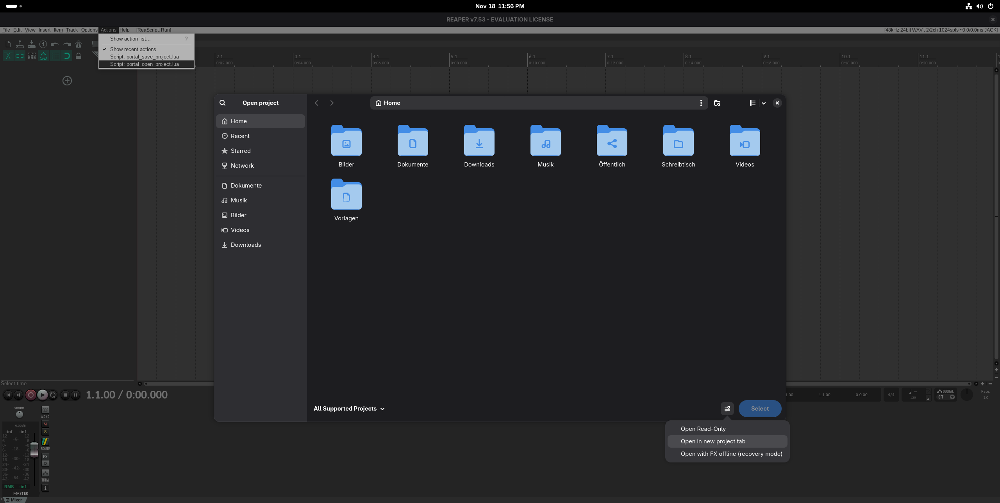
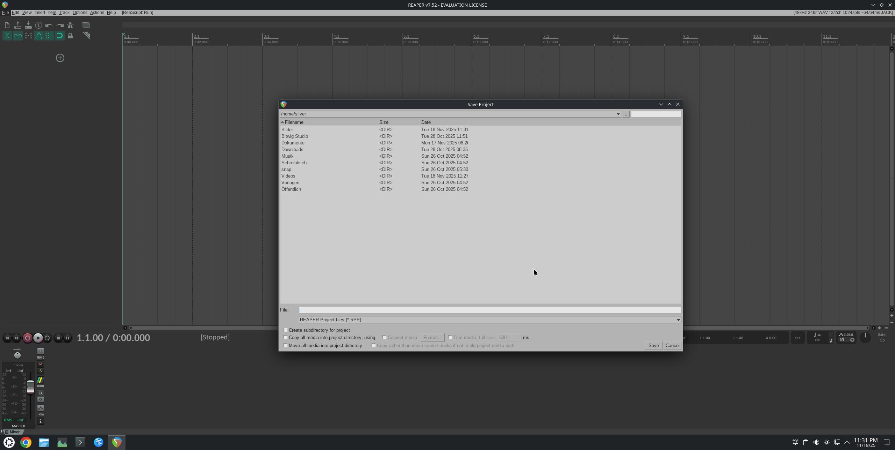
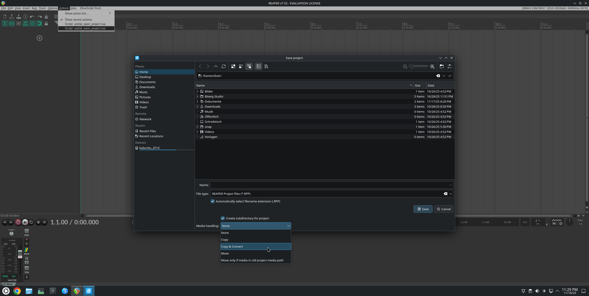
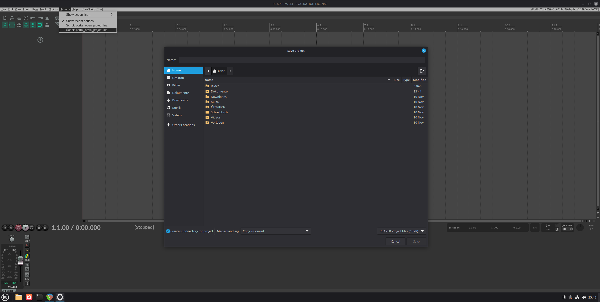

# REAPER Portal FileChooser (Demo)

**⚠️ Warning:** This is a **proof-of-concept** demo showing how native DBus portal file choosers could be integrated into REAPER.
It is **not intended for production use**. Use only if you fully understand what it does - at your own risk!

## Overview

The included **Python script** is application-agnostic.
It performs generic DBus calls to the xdg-desktop-portal service to open native file choosers, receives their responses, and outputs the result as JSON.
Run it with `--help` to see all supported options. It covers most parameters currently available in portal file choosers.

The accompanying **Lua script** demonstrates how such integration could look inside REAPER.
It is limited by the ReaScript API but serves as a conceptual reference for a potential native implementation.
See the list of shortcomings below for details.

**Open project:**

</img> </img> </img> </img>

**Save project:**

</img> </img> </img> </img>

## Features/Advantages

- Works with both native and Flatpak installations of REAPER.
- Automatically launches the native file chooser of the user’s desktop environment, providing better integration with bookmarks, theming, and UX consistency.
- Can act as a sub-window of REAPER through proper parenting (note: on Wayland, this requires a handle that only the running REAPER executable itself could provide).
- Supports a directory-only mode for selecting folders, similar to other OSes.
- Supports multi-file selection.
- Customizable dialog titles.
- Separate open and save modes optimized for their respective workflows.
- Accept button label can be customized (e.g., “Import” / “Export”).
- Supports multiple file type filters - the selected filter is returned for use (e.g., to determine a save format).
- Allows initial directory, file, or filename preselection.
- Supports multiple checkboxes and drop-down lists in any desired order.

## Known Limitations (Lua Demo)

- Selecting a different file type in the save dialog only changes the file extension; the actual project type remains .RPP.
REAPER’s ReaScript API currently does not provide a method to save in alternate formats.
- The “Copy & Convert” option in the save dialog is only a visual placeholder for demonstration purposes. It has no effect in this version.
- Some behaviors such as “Open in new tab” or making the just-saved project active are implemented using workarounds (e.g., reopening the project via an additional call).
These hacks are necessary due to ReaScript API limitations - a native implementation inside REAPER would not require them and would behave exactly like the built-in file choosers.

## Known Limitations (Portal File Choosers)

- Only checkboxes and drop-down menus are currently supported as custom UI elements.
Other widgets (buttons, text inputs, etc.) are not yet exposed through the portal API, even though the underlying toolkits would actually support this.
- The GTK file chooser (in open mode) always shows an unused “Open read-only” checkbox.
This is a quirk of the GTK portal backend - it appears for all portal calls, not just this script.
KDE and GNOME backends do not have this issue. It cannot be disabled at present, but it does not affect functionality.
- Remembering the last used folder or settings must be implemented by the host application (REAPER), which is probably consistent with its current behavior.

## Development and Debugging Tips

**Monitor live DBus responses**

    dbus-monitor --session "type='method_return'"

**Switching between KDE and GTK dialogs**

If you use a KDE-based distribution (e.g., Kubuntu), both KDE and GTK portal backends are usually available.

To force the GTK dialog, edit:

    ~/.config/xdg-desktop-portal/portals.conf

and set:

    [preferred]
    org.freedesktop.impl.portal.FileChooser=gtk

Then restart the portal services:

    systemctl --user restart xdg-desktop-portal xdg-desktop-portal-gtk

To revert, either comment out the entry or replace "gtk" with "kde".

**Testing the GNOME file chooser**

GNOME uses its own variant of the portal file chooser, which differs from the generic GTK one.
It also works seamlessly with portals.
To test it, use a GNOME-based distribution such as Fedora Workstation.
